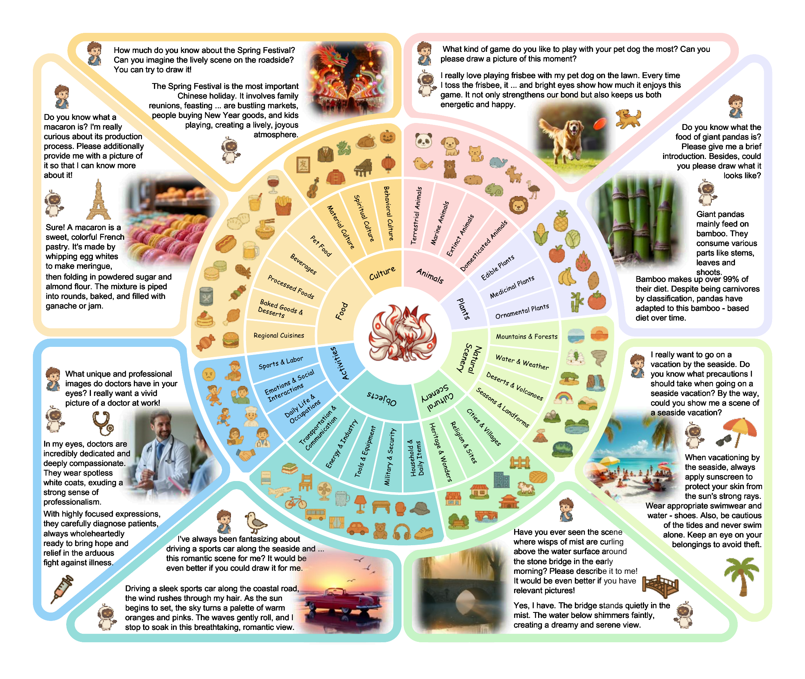
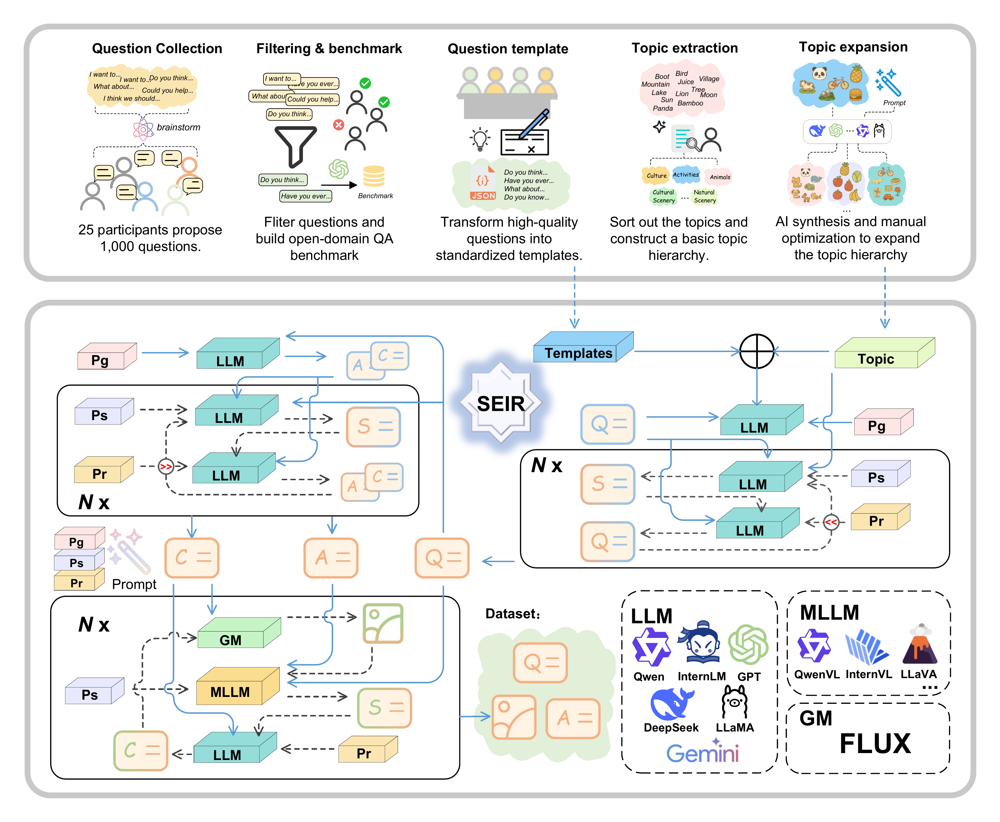
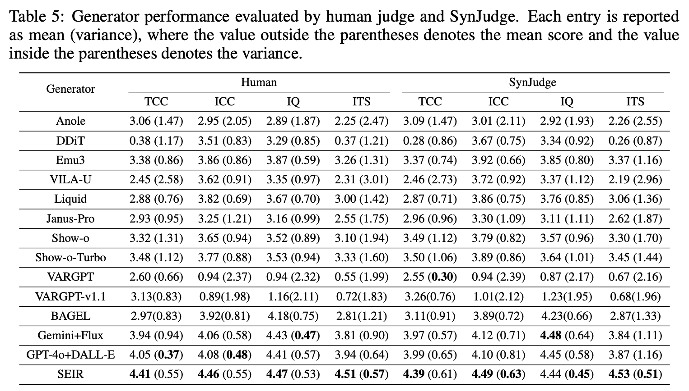

# A High-Quality Dataset and Reliable Evaluation for Interleaved Image-Text Generation

> Authors: Yukang Feng, Jianwen Sun, Chuanhao Li, Zizhen Li, Jiaxin Ai, Fanrui Zhang, Yifan Chang, Sizhuo Zhou, Shenglin Zhang, Yu Dai, Kaipeng Zhang · 2025
>
> contact: yukangfeng@mail.nankai.edu.cn
> 
> Recent advancements in Large Multimodal Models (LMMs) have significantly improved multimodal understanding and generation. However, these models still struggle to generate tightly interleaved image–text outputs, primarily due to the limited scale, quality, and instructional richness of current training datasets. To address this, we introduce InterSyn, a dataset that features: (1) large scale, comprising 1.8M multimodal samples; (2) high quality, supported by our proposed Self‑Evaluation with Iterative Refinement (SEIR) method for rigorous automated quality refinement; (3) rich instructional diversity, ensured through diverse well‑designed question templates, based on human preferences and covering a 3,500‑topic hierarchy. These characteristics make InterSyn particularly well‑suited for training LMMs in interactive image–text generation capabilities. To evaluate the capabilities, we propose SynJudge, a reliable automatic evaluator that aligns closely with human judgment and outputs four interpretable scores: Text Content Completeness (TCC), Image Content Completeness (ICC), Image Quality (IQ), and Image–Text Synergy (ITS). These scores are complementary, covering both content and quality as well as cross‑modal interaction, thereby forming a comprehensive evaluation framework. Experimental results on InterSyn subsets of up to 200K samples show that 25K–50K already yield substantial improvements, while scaling to 100K/200K brings further gains in TCC, ICC, and especially ITS, highlighting InterSyn’s: (1) scalability, as performance consistently improves with more data; (2) efficiency, as significant gains are achievable even with smaller subsets, making it accessible to researchers with varying computational resources.
> 
<p align="center">
  
  <br/>
  <em>Overview of the InterSyn dataset (from the paper).</em>
  <br/>
</p>

<p align="center">
  <a href="iclr2026/iclr2026_conference.pdf">
    
  </a>
  <a href="https://arxiv.org/abs/2506.09427">
    
  </a>
  <a href="SEIR_method">
    
  </a>
  <a href="SynJudge">
    
  </a>
  <a href="https://huggingface.co/datasets/finyorko/single_turn">
    
  </a>
  <a href="https://huggingface.co/datasets/finyorko/multi-turn">
    
  </a>
</p>


InterSyn is a large‑scale, high‑quality dataset and evaluation suite for instruction‑following, interleaved image–text generation.

- Scale: 1.8M multimodal samples (single‑turn) plus 50k multi‑turn dialogues across 8 domains and 3,500 topics.
- Quality: Generated and refined with SEIR (Self‑Evaluation with Iterative Refinement) to improve textual completeness, visual relevance, and cross‑modal synergy.
- Evaluation: SynJudge provides 4 interpretable dimensions — Text Content Completeness (TCC), Image Content Completeness (ICC), Image Quality (IQ), and Image–Text Synergy (ITS) — aligning closely with human judgments.

This README consolidates paper highlights and usage guides from `SEIR_method_README.md` and `SynJudge_README.md` into one place.


## Repository Map
- `iclr2026/` — LaTeX paper, figures, and appendix.
- `SEIR_method/` — Data construction with SEIR (code, configs, utilities).
- `SynJudge/` — Automatic evaluation scripts and prompts.


## 🔥 Quick Start: SEIR Data Construction

Declaration: The models in this repo are for demonstration purposes. Language model, vision‑language model, and generative model can be replaced as you wish.

- Config file: edit `SEIR_method/utils/config.ini` (model paths, parameters).

Run SEIR:
```bash
cd SEIR_method
CUDA_VISIBLE_DEVICES=2,3 python seir_method.py \
  --json_file_basename "data_test" \
  --output_parent_dir "./t2ti_data" \
  --dataset_id "00000" \
  --conversation_turn 5 \
  --mod_q_suggestion_num 3 \
  --mod_ac_suggestion_num 3 \
  --mod_c_suggestion_num 3 \
  --dataset_size 10000 \
  --save_batch_size 10
```

Key parameters:
- `json_file_basename`: name of input JSON base.
- `output_parent_dir`: parent directory for outputs (JSONL, images).
- `dataset_id`: subdirectory under parent; final path is `output_parent_dir/dataset_id`.
- `conversation_turn`: max turns; each sample randomly uses 1..T turns.
- `mod_q_suggestion_num`: number of question refinements.
- `mod_ac_suggestion_num`: number of answer refinements.
- `mod_c_suggestion_num`: number of caption refinements.
- `dataset_size`: number of samples to generate.
- `save_batch_size`: batch size when saving.


## 🔥 Quick Start: SynJudge Evaluation

Inputs:
1) Prepare a `model_answer.jsonl` with your model’s outputs to be scored.
2) Use a judge script to produce per‑sample scores JSONL.
3) Compute mean and variance.

Score prompt: `SynJudge/score_prompt.txt`

Judge with GPT‑4o:
```bash
cd SynJudge
python gpt-4o_judge.py \
  --input_file "model_answer_to_judge.jsonl" \
  --output_file "gpt-4o_scores.jsonl" \
  --prompt_file "score_prompt.txt" \
  --image_dir "/path/to/your/images" \
  --api_key "sk-your-actual-api-key" \
  --api_host "127.0.0.1:8000"
```

Judge with InternVL:
```bash
python internvl_judge.py \
  --model_path "/path/to/your/internvl_model" \
  --model_name "InternVL2_5-78B" \
  --image_dir "/path/to/your/images" \
  --input_file "model_answer_to_judge.jsonl" \
  --output_file "internvl_scores.jsonl" \
  --save_interval 20
```

Judge with QwenVL (SynJudge):
```bash
python qwenvl_judge.py \
  --model_path "Qwen/Qwen2.5-VL-32B-Instruct" \
  --image_dir "/path/to/your/images" \
  --input_file "model_answer_to_judge.jsonl" \
  --output_file "qwenvl_scores.jsonl" \
  --save_interval 20
```

Compute mean and variance:
```bash
python compute_mean_var.py \
  --input_file "qwenvl_scores.jsonl" \
  --output_file "qwenvl_mean_var.jsonl"
```


## Method: SEIR (Self‑Evaluation with Iterative Refinement)

SEIR refines a multi‑turn conversation sample across three cascaded stages per turn: Question Refinement (QR), Answer Refinement (AR), and Image Refinement (IR). Each stage iterates with self‑evaluation feedback, improving textual completeness, visual relevance, and image–text synergy.

<p align="center">
  
  <br/>
  <em>Overview of the InterSyn construction pipeline and the SEIR method.</em>
  <br/>
</p>

Effectiveness snapshot:
- QR improves question quality substantially in the first 3 iterations, then plateaus — we set QR=3 for construction.
- AR mainly boosts TCC/ICC (content completeness); IR further improves ICC and ITS (cross‑modal synergy).


## 📊 Results Overview

<p align="center">
  
  <br/>
  <em>Overview of the generator performance.</em>
  <br/>
</p>

## ✍️ Citation
If you find InterSyn, SEIR, or SynJudge helpful, please cite the paper:

```
@misc{feng2025highqualitydatasetreliableevaluation,
      title={A High-Quality Dataset and Reliable Evaluation for Interleaved Image-Text Generation}, 
      author={Yukang Feng and Jianwen Sun and Chuanhao Li and Zizhen Li and Jiaxin Ai and Fanrui Zhang and Yifan Chang and Sizhuo Zhou and Shenglin Zhang and Yu Dai and Kaipeng Zhang},
      year={2025},
      eprint={2506.09427},
      archivePrefix={arXiv},
      primaryClass={cs.CV},
      url={https://arxiv.org/abs/2506.09427}, 
}
```


## Contact
- For issues and questions, please open a GitHub issue.
